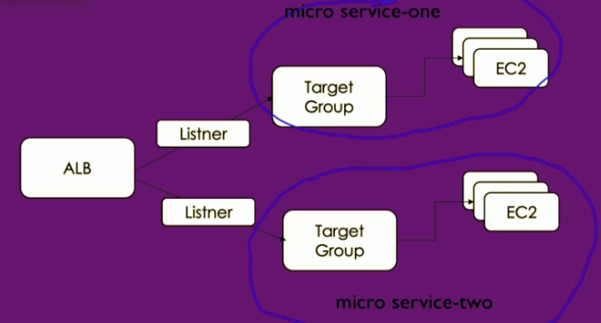
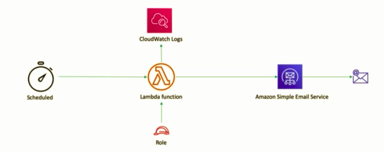

# [terraform-jenkins](https://github.com/murshidazher/terraform-jenkins)

> The end-to-end workflow with terraform, jenkins and ansible playbooks 🔥🔥🔥

- This has all the terraform and jenkins workflow, once you have a full infrastructure as code using terraform you would use jenkins to deploy them to their individual environments.
- We can write jenkins pipeline scripts to configure these deployment as well as ansible playbooks which will be integrated with jenkins and terraform.
- This contains step by step instructions and at the end of this README you will find yourself with a fully automated terraform workflow.

## Table of Contents

- [terraform-jenkins](#terraform-jenkins)
  - [Table of Contents](#table-of-contents)
  - [Installing terraform manually](#installing-terraform-manually)
  - [Up & Running](#up--running)
    - [Terraform Outputs & Interpolations](#terraform-outputs--interpolations)
      - [Interpolations](#interpolations)
    - [Terraform Local State Files](#terraform-local-state-files)
    - [Terraform Remote State File](#terraform-remote-state-file)
    - [Terraform Locking Remote State Files](#terraform-locking-remote-state-files)
    - [Terraform Variables](#terraform-variables)
    - [Terraform Workspace](#terraform-workspace)
    - [Terraform Loops](#terraform-loops)
    - [Terraform Conditions](#terraform-conditions)
    - [Terraform Local Variables](#terraform-local-variables)
  - [Setting Up Networking For Our Applications](#setting-up-networking-for-our-applications)
    - [Data sources](#data-sources)
    - [Associating Public Subnet with Internet Gateway](#associating-public-subnet-with-internet-gateway)
      - [Route Table Creation](#route-table-creation)
      - [Subnet Association](#subnet-association)
    - [Private Subnet](#private-subnet)
    - [Enable Subnet Settings Fot Auto Assigning Public Ip](#enable-subnet-settings-fot-auto-assigning-public-ip)
    - [Configure NAT instance](#configure-nat-instance)
    - [Configure NAT Instance - Security Group](#configure-nat-instance---security-group)
  - [EC2 Instances, ELB and IAM Roles - InProgress](#ec2-instances-elb-and-iam-roles---inprogress)
    - [User data](#user-data)
    - [IAM Roles](#iam-roles)
    - [Create a Security Group for EC2](#create-a-security-group-for-ec2)
    - [Elastic Load Balancer with EC2](#elastic-load-balancer-with-ec2)
    - [EC2 key pair](#ec2-key-pair)
  - [EC2 Auto Scaling](#ec2-auto-scaling)
  - [Route53 For ELB](#route53-for-elb)
  - [RDS - Relational Database Service](#rds---relational-database-service)
    - [Create RDS Instance](#create-rds-instance)
    - [Create Private subnet group for RDS](#create-private-subnet-group-for-rds)
  - [ALB - Application Load Balancer](#alb---application-load-balancer)
    - [ALB Access Logs - S3 buckets](#alb-access-logs---s3-buckets)
  - [Terraform and Lambda functions](#terraform-and-lambda-functions)
  - [Terraform - Build reusable modules](#terraform---build-reusable-modules)
  - [Realtime Use cases With Lambda & Terraform](#realtime-use-cases-with-lambda--terraform)
  - [Jenkins and terraform integration](#jenkins-and-terraform-integration)
    - [Getting Started](#getting-started)
    - [Install Terraform Plugins on Jenkins](#install-terraform-plugins-on-jenkins)
    - [Writing Jenkins file](#writing-jenkins-file)
    - [Adding terraform to path](#adding-terraform-to-path)
    - [Create IAM role and Granting access to terraform through Jenkins](#create-iam-role-and-granting-access-to-terraform-through-jenkins)
    - [Jenkins Pipeline - Terraform init and apply](#jenkins-pipeline---terraform-init-and-apply)
    - [Create S3 bucket for remote state using Jenkins pipeline](#create-s3-bucket-for-remote-state-using-jenkins-pipeline)
    - [Github Webhooks - Auto trigger jenkins job](#github-webhooks---auto-trigger-jenkins-job)
  - [Integrating Ansible with Terraform](#integrating-ansible-with-terraform)
    - [Ansible Playbook to create S3 bucket to store state file](#ansible-playbook-to-create-s3-bucket-to-store-state-file)
    - [Write Ansible Playbook to run terraform scripts](#write-ansible-playbook-to-run-terraform-scripts)
  - [Tools](#tools)
  - [License](#license)

## Installing terraform manually

```sh
> cd Downloads
> mv terraform /usr/local/bin # this will add it to the path
> terraform --version
```

## Up & Running

We will occasionally use the `terraform init` at the start of a project and in some undeniable situations,

```sh
> terraform init
> terraform apply
```

### Terraform Outputs & Interpolations

#### Interpolations

`${}` this is an interpolations in terraform. We can check the values returned back we can see the [reference attributes](https://registry.terraform.io/providers/hashicorp/aws/latest/docs/resources/vpc#attributes-reference). Example of this would be, `${aws_vpc.my_vpc.cidr_block}`.

### Terraform Local State Files

If the local `terraform.tfstate` file is deleted then all the resources created using this terraform file would lose its connection meaning that the resources would be still available in the aws account but terraform wont have ny control over it.

As a best practice never tamper with this file and we should preserve it.

### Terraform Remote State File

> The terraform s3 backend [documentation](https://www.terraform.io/docs/language/settings/backends/s3.html). Create the s3 bucket manually or use another terraform file to create it.

In order to solve multiple users collaborating together to work with the same terraform state, we need to have a remote backend. The most preferred backend out of it all is the `s3` backend.

This bucket cant be create inside the file because before any resources is created it needs to check the state file. To do that this bucket should exists.

After adding the bucket details we need to reinitialize terraform,

```sh
> terraform init
```

We can delete the local files afterwards since it wont be used afterwards
- We need to enable `versioning` so we can go back to a previous version of the state if needed.
- We also need to enable `encryption` so that if are using RDS, the RDS password would be in the `tfstate` so encryption will prevent the password being out in the open.

### Terraform Locking Remote State Files

> Name of DynamoDB table is used for [state locking](https://www.terraform.io/docs/language/settings/backends/s3.html#dynamodb-state-locking)

If multiple users are creating resources from the same state file concurrently then it can create inconsistent state files.

It is always good to keep a log on the current user working on the state file and block the remaining users until the present user operations are complete.

The `dynamodb` table will be used for state locking, so we need to manually create this table before executing the terraform script. It should also have have a primary key named `LockID` with type of `string`.

```txt
aws console -> dynamodb -> create table
table name: javahome-tf
primary key: LockID 
type: string
```

Again we need to use terraform init, to reinitialize the lock. If we make an update we will have a dynamodb entry and after its successful there wont be any lock to it.

### Terraform Variables

If a type isn't given then the type is inferred by the given default value. If we need to change the value on runtime,

```sh
> terraform apply -var "vpc_cidr=10.30.0.0/16" #overrides the default value
> terraform apply -var "vpc_cidr=10.30.0.0/16" -auto-approve # to approve the changes
```

We can also use any filename with the `tfvars` extension to pass environment and multiple values,

```sh
> terraform apply -var-file=dev.tfvars
```

### Terraform Workspace

Mantaining multiple environment in terraform can be tedious, what if we need a `dev` and `prod` environment with same configuration but maintain different varaibles.

This is where we need workspaces, and terraform by default maintains one workspace called `default`.

```sh
> terraform workspace list # created at terraform init
* default
```

To create two new workspaces,

```sh
> terraform workspace new dev
> terraform workspace new prod
```

Terraform will maintain a seperate state file for `dev` and a seperate state file for `prod`. Inside the s3 remote backend there would be a dir called `env -> dev | prod` and inside that we can find the state files.

If we need to provision the resources in the dev workspaces we need to first select the dev workspace.

```sh
> terraform workspace select dev
> terraform apply
```

We can reference the terraform current workspace to get the current env to add the environment to tags.

```tf
resource "aws_vpc" "my_vpc" {
  cidr_block       = var.vpc_cidr
  instance_tenancy = "default"

  tags = {
    Name        = "JavaHomeVPC"
    Environment = "${terraform.workspace}"
    Location    = "India"
  }
}
```

### Terraform Loops

What if we need to create 10 VPC instances, we can use the loops. We can use the `count` attribute to loop.

```tf
resource "aws_vpc" "my_vpc" {
  count            = 10
  cidr_block       = var.vpc_cidr
  instance_tenancy = "default"

  tags = {
    Name        = "JavaHomeVPC"
    Environment = "${terraform.workspace}"
    Location    = "India"
  }
}
```

### Terraform Conditions

What if certain configuration should be used only in `dev` and not in production then we can use the conditions. What if we only need to create a vpc in `prod`, `count = 0` means doesn't create the vpc.

```tf
resource "aws_vpc" "my_vpc" {
  count            = "${terraform.workspace == "dev"? 0 : 1}"
  cidr_block       = var.vpc_cidr
  instance_tenancy = "default"

  tags = {
    Name        = "JavaHomeVPC"
    Environment = "${terraform.workspace}"
    Location    = "India"
  }
}
```

### Terraform Local Variables

If we have an expression repeatedly used inside our code we can use them as a part of our local variable and make use of them. In the future, if we need to change it we can change it in a single place. You use the `local` body to create a local variable.

```
locals {
  vpc_name = terraform.workspace == "dev" ? "javahome-dev" : "javahome-prod"
}


resource "aws_vpc" "my_vpc" {
  count            = terraform.workspace == "dev" ? 0 : 1
  cidr_block       = var.vpc_cidr
  instance_tenancy = "default"

  tags = {
    Name        = "${local.vpc_name}"
    Environment = "${terraform.workspace}"
    Location    = "India"
  }
}
```

## Setting Up Networking For Our Applications

> Look into the [02.networking]()

```sh
> terraform init
> terraform workspace new dev
> terraform workspace new prod
```

For high availability, we need multiple subnets spanning multiple regions and with an internet gateway so its accessible. Search for `terraform subnet` in [google](https://registry.terraform.io/providers/hashicorp/aws/latest/docs/resources/subnet).

### Data sources

> We create a `datasources.tf` file. We could access the data from datasource by using the `data.{datasource_name}.{type}`

We can use data sources to dynamically fetch availability zones. Data sources it available such that we can import certain information which are available outside the terraform.

Example, to get the recently created ami source we can use this data source,


To create subnets for availability zones in the specified regions we can use this,


Generates cidr blocks dynamically by adding 8 bits,

```tf
cidrsubnet(var.vpc_cidr, 8, count.index) # looks like 10.20.1.0/24 -> 10.20.2.0/24 ....
```

### Associating Public Subnet with Internet Gateway

#### Route Table Creation

> Search for `terraform route table` in google and click the first terraform link to docs.

```tf
resource "aws_route_table" "prt" {
  vpc_id = "${aws_vpc.my_app.id}"

  route {
    cidr_block = "0.0.0.0/0"
    gateway_id = "${aws_internet_gateway.igw.id}"
  }

  tags = {
    Name = "JavaHomePRT"
  }
}
```

#### Subnet Association

> Google for `terraform subnet association`.

We need to associate the route table with public subnets.


```tf
resource "aws_route_table_association" "pub_sub_asociation" {
  count          = "${length(local.az_names)}"
  subnet_id      = "${local.pub_sub_ids[count.index]}"
  route_table_id = "${aws_route_table.prt.id}"
}
```

### Private Subnet

Coming to private subnets we can leave like this `count = length(local.az_names)`
but this will create a private subnet for each public subnet. But we want to create only need to create `2` private subnets, so that if we are configuring RDS and need multi-AZ we maximum need only 2 private subnets.

- We are only taking 2 elements from the list.
- We can pick the cidr blocks for subnets after the public subnets were left off.
- We've a default route table for it so that the internet gateway as it is private by default.

```tf
count             = length(slice(local.az_names, 0, 2))
vpc_id            = aws_vpc.my_app.id
cidr_block        = cidrsubnet(var.vpc_cidr, 8, count.index + length(local.az_names))
```

### Enable Subnet Settings Fot Auto Assigning Public Ip

Use `map_public_ip_on_launch` to auto assign ip

```tf
map_public_ip_on_launch = true
```

### Configure NAT instance

We've to configure internet access to private subnets, we are going to use NAT instances without NAT gateway which can also be used.

AMI ids are specific to regions so we cant use the same ami id for all regions. So add all the regions and mapping ami in the variables.

Next, we need to create a route table and add NATs instance to the route table. Read this [doc](https://registry.terraform.io/providers/hashicorp/aws/latest/docs/resources/route_table_association).

### Configure NAT Instance - Security Group

We have to secure NATS instances using security groups.

## EC2 Instances, ELB and IAM Roles - InProgress

> Deploying EC2 instances into the public subnets and later using user data we can install apache webserver. Read more on [terraform interpolation docs](https://www.terraform.io/docs/configuration-0-11/interpolation.html#supported-built-in-functions).

### User data

Since `user-data` scripts are launch time scripts when we update it then we will be destroying the existing instances and creating new instances.

### IAM Roles

We need to first create an `assume policy` > `iam policy` > `iam role`. Since, we need to make this file dynamic at runtime we need to make use of terraform [template files](https://registry.terraform.io/providers/hashicorp/template/latest/docs/data-sources/file).

```json
{
  "Version": "2012-10-17",
  "Statement": [
    {
      "Sid": "Stmt1563521329921",
      "Action": [
        "s3:PutObject"
      ],
      "Effect": "Allow",
      "Resource": "${s3_bucket_arn}"
    }
  ]
}
```

```tf
data "template_file" "s3_web_policy" {
  template = file("scripts/iam/web-ec2-policy.json")
  vars = {
    s3_bucket_arn = "arn:aws:s3:::${var.my_app_s3_bucket}/*"
  }
}
```

We need to call the rendered so that we get the rendered json `data.template_file.s3_web_policy.rendered`. 

We also need to create an instance profile to attach iam policies to an instance.

### Create a Security Group for EC2

We need to add our own ips to the ssh because in production we should limit the ssh access from the outside.

```tf
# ssh
  ingress {
    from_port   = 22
    to_port     = 22
    protocol    = "tcp"
    cidr_blocks = ["0.0.0.0/0"] # in production, we shouldn't do this the cidr block should be our own ips so no outside access
  }
```

We need to attach this security group to the ec2 instance and we can attach multiple of it so it needs to be a list.

### Elastic Load Balancer with EC2

> Google for `terraform elb` and you would find [this link](https://registry.terraform.io/providers/hashicorp/aws/latest/docs/resources/elb).

Right now at this moment we would have two webservers running in the public subnets. We need to keeps these two instances behind a elastic load balancer.


> 💡 Add `ssl_certificate_id` and cert if required in production to [elb](./02.networking/elb.tf).

### EC2 key pair

We need to have some ec2 key-pair to login to the instance incase of trouble shooting and maintenance. We need to create a public and private key pair.

```sh
> ssh-keygen
> cat /Users/murshidazher/.ssh/id_rsa.pub # copy it and create a new file `scripts/web.pub` 
> terraform apply
```

Go to the ec2 instance and check the key-pair you would see the key called `javahome-web`.

## EC2 Auto Scaling

> Configurations are found in [autoscaling.tf](02.networking/autoscaling.tf)

Next, we need to create auto-scaling for high availability. We also need to create a key-pair for this ssh which is created previously.

You can check the effect on `aws console`> `EC2 management console` > `launch config` and `auto scaling groups`.

Now, we can remove the `web-ec2.tf` script since its no longer needed to create ec2 instances manually since its managed by the autoscaling group.

## Route53 For ELB

> 💡 We need to add `ssl` certification to this domain name too.

Since we need our clients to access the application with friendly domain names we can use the `Route53` service to integrate `ELB` with friendly domain name.

We need to get a domain from `route53` example `abc123xyz.tk` and then associate the elb with it. Its should be a public domain so it could be used to access it.

## RDS - Relational Database Service

### Create RDS Instance

Ideally most of the values of the RDS instance would be set using variables since it depends on the environment. Moreover, the database password needs to entered during the runtime too and not hardcoded.

### Create Private subnet group for RDS

> 💡 Autoscaling can also be enabled if we're running out of storage but for this demonstration I've left this part out.

We will create a private subnet group and place the relational database inside it.

Ingress by default mysql runs on `3306`. If you need to access rds from organization add those `security_groups` as comma inside ingress. Disable minor version upgrades and enable backup.

## ALB - Application Load Balancer

- In place of ELB, we can also use the ALB. The scenario for ALB is if we have micro-services instances were each instances is grouped together. Where we route the requests based on which port numbers the request is coming to which is defined in the listener.
- With one ALB, we can load balance all the request in our application.



Before we provision alb, we need to create target groups. Then attach ec2 instances to the created target group. All `alb` logs would be sent to this bucket by enabling s3 bucket policies.

### ALB Access Logs - S3 buckets

We will be creating a alb bucket.

To run only a simple script then we can use the target

```sh
> terraform apply -auto-approve --target=aws_s3_bucket.alb_access_logs
```

## Terraform and Lambda functions

Deploying lambda using terraform. Lambda function takes two arguments `events` and `context`. This demonstrates how to deploy lambda function using terraform code.

- [terraform iam_role_policy](https://registry.terraform.io/providers/hashicorp/aws/latest/docs/resources/iam_role_policy)
- Use [aws policy generator](https://awspolicygen.s3.amazonaws.com/policygen.html) online tool to get the policies.
- [terraform lambda func](https://registry.terraform.io/providers/hashicorp/aws/latest/docs/resources/lambda_function)
- We need to create a [terraform archive](https://registry.terraform.io/providers/hashicorp/archive/latest/docs/data-sources/archive_file) zip file for hosting function.

## Terraform - Build reusable modules

Terraform Module is a folder containing terraform scripts so its organizable and re-usable. Re-use modules in different environments.

- [vpc](https://registry.terraform.io/providers/hashicorp/aws/latest/docs/resources/vpc) and [subnets](https://registry.terraform.io/providers/hashicorp/aws/latest/docs/resources/subnet)
- ami ids are specific to regions so ami id of one region doesnt work for another. So replace it.

```sh
> cd 04.organizing
> terraform init
> terraform apply
```

## Realtime Use cases With Lambda & Terraform

> Schedule lambda function to find unused elastic ips (EIPS) and send that information by email using SES. 💡 To send email the `SOURCE_EMAIL` address needs to be verified in `ses`.



Give the `SOURCE_EMAIL` and `DEST_EMAIL` as env variables, `boto3` is the aws client sdk for python,

```tf
variables = {
  SOURCE_EMAIL = "sourceemail@gmail.com",
  DEST_EMAIL   = "destemail@gmail.com"
}
```

> 💡 We can use email template if we need it to be more prettier and tabular format.

## Jenkins and terraform integration

Jenkins is used in organization as,
- Automation Server
- Continuous Integration server
- Build CI/CD pipeline

### Getting Started

- Create an EC2 instance with t2.micro
- Open for all port (for dev only but in prod only for specific ips)
- Create a new key pair
- Login to the ec2 instance using the private key file and jenkins public instances.

```sh
> chmod 400 ../some-key.pem # to restrict access to key and only read
> ssh -i ../some-key.pem ec2-user@15.203.156.137
```

- Install jre and jenkins,

```sh
> sudo yum list | grep java-1.8.0
> sudo yum install java-1.8.0-openjdk # contains both jre and dev kit
```

- Go to [jenkins.io/downloads](https://www.jenkins.io/downloads) and download centOS version. Run the commands as specified in the instruction.

```sh
> sudo service jenkins start
> sudo chkconfig jenkins on # autostarts if its closed
```

- Go to the instance ip in browser for port `8080` and make the jenkins initial configurations, ex: `http://79.203.45.23:8080`. We need the initial password in the specified location. 

```sh
> sudo cat /var/lib/jenkins/secrets/initialAdminPassword
```

- Install the suggested plugins and then create the admin user.

### Install Terraform Plugins on Jenkins

We need terraform plugin on jenkins to execute terraform commands.

- Go to manage jenkins > manage plugins > available > search for `terraform` > select terraform and install without restart.
- We need to configure the plugin under global tool configuration > Add terraform > name: `terraform-12`. We can have multiple installers with multiple names. Select install automatically and `terraform 0.12.12 linux (amd64)`. Save.

### Writing Jenkins file

> We need to execute the pipeline on git commit.

- We are going to provision two different environments one is `dev` and `prod`. 
- In the same workspace, write a `Jenkinsfile` technically this file name can be anything but the convention is to use the Jenkinsfile name. We will be using declarative pipeline which begins with pipeline block.
- We would have multiple stages with multiple blocks.
- Lets configure a jenkins job and execute ans see how it works.
- Go the jenkis server dashboard > new item > name it: ex: `terraform` > type of job is `pipeline` > Save
- Go to pipeline > location: `Pipeline script from SCM` > Git and the url of the repository. No need of credentials for public repo.
- Make sure of the `scriptname` of the file.

> 💡 You might get an error if you haven't install github cli locally on jenkins server.

```sh
> ssh -i ../some-key.pem ec2-user@15.203.156.137
> sudo yum install git -y
```

- Save the file and Build Now. It should fail initially stating terraform command not found.

### Adding terraform to path

- Go to `pipeline syntax` which is the pipeline syntax generator which helps us to generate terraform pipeline scripts.
- Sample step select `tool: Use a tool from predefined tool installation` > tool type: `terraform` > tool: `terraform-12`
- Generate pipeline script. Copy the script and paste it in the jenkins file. For best practice, declare a function which returns the terraform path.

```txt
tool name: 'terraform-12', type: 'org.jenkinsci.plugins.terraform.TerraformInstallation'
```

- We need to add this function as environment path, hence in the same pipleine script generator, select `Declarative Directive Generator` > sample directive: `environment` > Name: `PATH` > Value: `${PATH}` > Generate. This will only exist for the current job.
- Now, append the generated code with terraform path.
- commit the code and build it.

### Create IAM role and Granting access to terraform through Jenkins

- Now, the jenkins is expecting aws credentials for access terraform. 
- Create an iam role aws service > for ec2 instance > administrative access > create role.
- Go to e2 instances > select the ec2 instance and `attach/replace iam role`. Select the newly created role and apply.

### Jenkins Pipeline - Terraform init and apply

- We use the return exit status so that we can continue even it if fails

### Create S3 bucket for remote state using Jenkins pipeline

We will be creating the s3 bucket too using the jenkins pipeline scripts.

### Github Webhooks - Auto trigger jenkins job

- To automatically trigger the jenkins job, go to `github` > `settings` > `webhooks` > `add webhook` > payload url: `http://url-of-jenkins-machine:8080/github-webhook/` > content-type: `application/json` > add web hooks.
- Select the job > `configure` > `build triggers` > `github hook trigger for GitScm polling`
- Create a demo commit to test the webhook trigger.

## Integrating Ansible with Terraform

- Ansible is an opensource and popular configuration management tool in devops space.
- The benefits on wrapping ansible on top of terraform commands, we cant create s3 buckets inside the terraform script so we need to create this bucket outside the terraform script. We can simply the remote state bucket creating by using anisble script.
- Since we can use terraform variables in the remote state bucket, if we hardcode the name then we cant differentiate the dev state and prod state. We can also use ansible to dynamically change these.
- Lets, install ansible on the server instance.

```sh
> ssh -i ../some-key.pem ec2-user@15.203.156.137
> sudo yum install python-pip -y
> sudo pip install ansible 
> sudo pip install boto3 
```

### Ansible Playbook to create S3 bucket to store state file

- We need to create an ansible playbook to create the bucket
- we write playbooks using yaml, we need to specify where to execute the scripts.
- Google for `ansible s3 bucket`, this [link](https://docs.ansible.com/ansible/2.3/s3_bucket_module.html).
- We need `boto3` internally to create s3 buckets.

### Write Ansible Playbook to run terraform scripts

- The next step is we need to run terraform commands through anisble playbooks
- stage `present` will create the aws resources while `absent` will destroy those resources.
- We use the workspace to separate state files in terraform meaning if its `dev` then the workspace will also be `dev`.
- `become: True` will execute all the tasks with `sudo` access.

## Tools

- [jenkins](https://www.jenkins.io/)
- [terraform](https://www.terraform.io/docs/index.html)
- [ansible](https://www.ansible.com/)
- [git](https://git-scm.com/)

## License

[MIT](https://github.com/murshidazher/terraform-jenkins/blob/main/README.md) © Murshid Azher.
